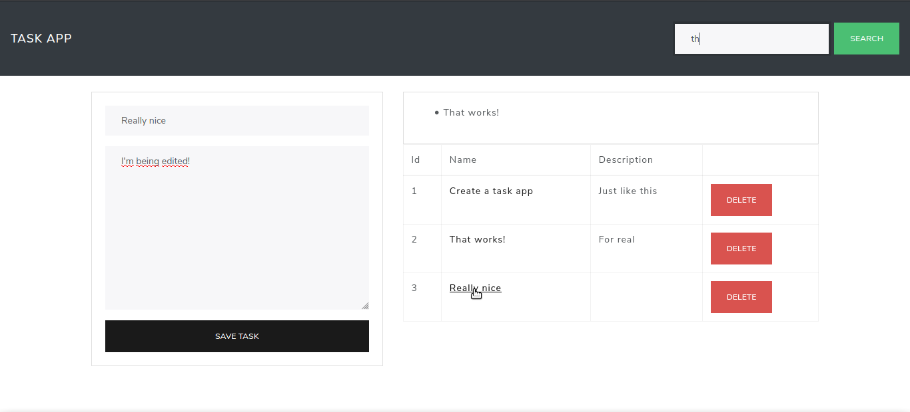

# task-app
___

___
 Um aplicativo de tarefas construído com as seguintes ferramentas:
- **JavaScript**
    - Ajax
    - JQuery
- **CSS**
    - Bootstrap 4
- **PHP 7**
- **MySQL**

Ao ter terminado de seguir os passos do curso, decidi implementar algumas melhorias que, na minha opinião, deixaram algo bom ainda melhor.

Notei que no projeto original, ao clicar nos links para realizar a edição a página atualizava como o comportamento padrão de um link.

Caso fosse necessário editar mais de um item haveria uma atividade ociosa de descer até a tarefa desejada novamente (e seria muito, muito chato).

Isso era causado pelo atributo ```href="#"```, que ao ser removído parou de atualizar a página indevidamente. Adicionei uma classe para manter o cursor do mouse como o gesto de clique.

E após isso adicionei uma classe declarando ```position: sticky``` no formulário de tarefas.

Possibilizando agora a edição de vários itens muito mais eficientemente.

___
Nota: Eu planejo desenvolver um crud seguindo os princípios do curso, mas utilizando JavaScript puro


[Link do curso de AJAX](https://www.youtube.com/watch?v=GeCNShiLdpc "Curso AJAX com PHP")
